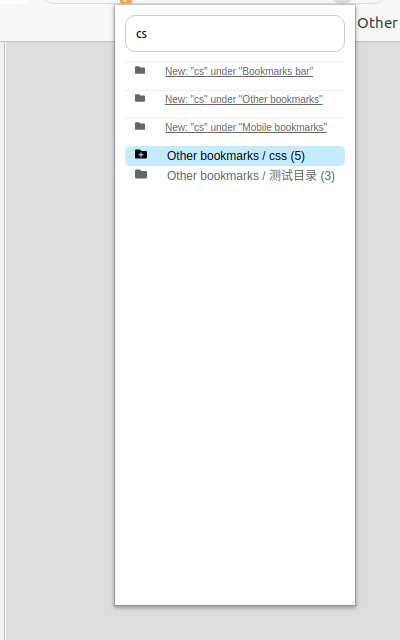
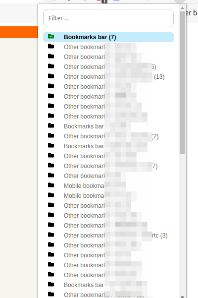

Quick Bookmark
======================
[Chrome Webstore](https://chrome.google.com/webstore/detail/quick-bookmark/bbjekmkfbdemdbfkckbakmmiceppjkdc)

Web browser extension that lets you easily add bookmarks to any category. Includes spotlight-like search with mouse/keyboard support.
Also support Chinese pinyin.

key binding
===========
Default keybinding is `ctrl + B` or `command + B` for Mac OS users, you can change it at
[Chrome extensions shortcuts](chrome://extensions/shortcuts)

You may also active it by clicking on the icon

## Features

- Deleting or adding current page to a folder or bookmark bar
- Create folder on the fly
- Search Chinese folders by pinyin
- Releases are automatically generated by github CI

TODO:

- [ ] suggest folder by Chrome [built-in AI](https://developer.chrome.com/docs/ai/built-in)

**The project won't exist without:**

- [chrome-better-bookmark](https://github.com/ardcore/chrome-better-bookmark)
- [web-extension-starter](https://github.com/abhijithvijayan/web-extension-starter)
