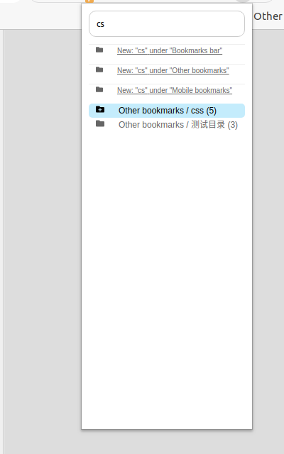
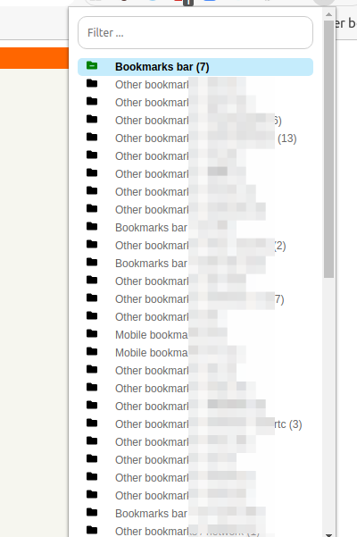

Quick Bookmark
======================
[Chrome Webstore](https://chrome.google.com/webstore/detail/quick-bookmark/bbjekmkfbdemdbfkckbakmmiceppjkdc)


Web browser extension that lets you easily add bookmarks to any category. Includes spotlight-like search with mouse/keyboard support.
Also support Chinese pinyin.

key binding
===========
Default keybinding is `ctrl + B` or `command + B` for Mac OS users, you can change it at
[Chrome extensions shortcuts](chrome://extensions/shortcuts)

You may also active it by clicking on the icon


## Features

- Deleting or adding current page to a folder or bookmark bar
- Create folder on the fly
- Search Chinese folders by pinyin
- Releases are automatically generated by github CI

## Publishing to the Chrome Web Store

Build and publish from the command line with a Google Cloud [service account](https://developer.chrome.com/docs/webstore/service-accounts):

1. Enable the Chrome Web Store API in a Google Cloud project and create a service account with a JSON key.
2. Add the service account email to your Chrome Web Store Developer Dashboard under **Account**.
3. Export the required credentials:

```sh
export GOOGLE_SERVICE_ACCOUNT_KEY=/path/to/service-account-key.json
export WEB_STORE_PUBLISHER_ID=your-publisher-id   # from Developer Dashboard > Publisher > Settings
export WEB_STORE_EXTENSION_ID=bbjekmkfbdemdbfkckbakmmiceppjkdc
```

4. Publish:

```sh
yarn publish:chrome
```

This builds `extension/chrome.zip` then uploads and publishes it. Options:

```sh
yarn publish:chrome -- --no-publish                 # upload only
yarn publish:chrome -- --target TRUSTED_TESTERS     # upload + publish to trusted testers
yarn publish:chrome -- --zip /path/to/chrome.zip    # use an existing zip
```

You must bump the `version` in `source/manifest.json` for uploads to succeed.






TODO:

- [ ] suggest folder by Chrome [built-in AI](https://developer.chrome.com/docs/ai/built-in)

**The project won't exist without:**

- [chrome-better-bookmark](https://github.com/ardcore/chrome-better-bookmark)
- [web-extension-starter](https://github.com/abhijithvijayan/web-extension-starter)
